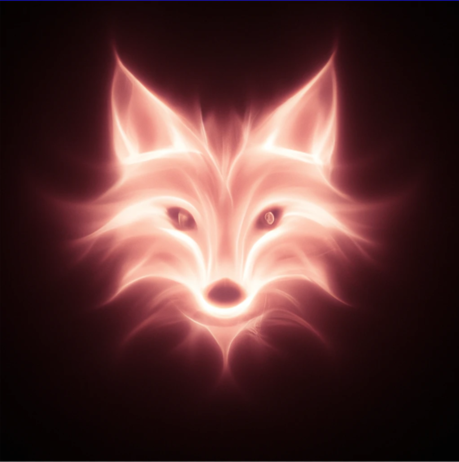

# 🦊 Fox Vulkan Path Tracing Renderer

A low-level forward path tracing renderer built from scratch using the **Vulkan API** and **C++**

## 📌 Overview

The **Fox Vulkan Path Tracing Renderer** leverages modern GPU hardware to produce photorealistic imagery. It features robust support for the glTF 2.0 standard and utilizes a physically based rendering (PBR) pipeline to accurately simulate light interaction.